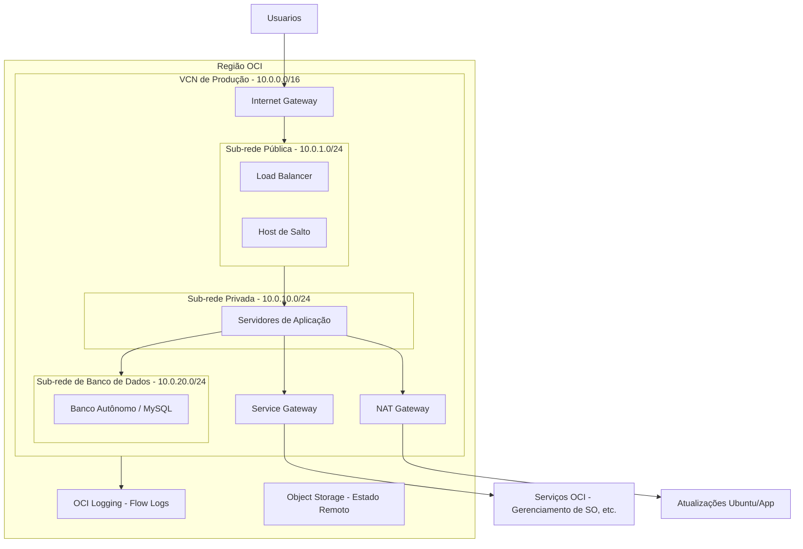
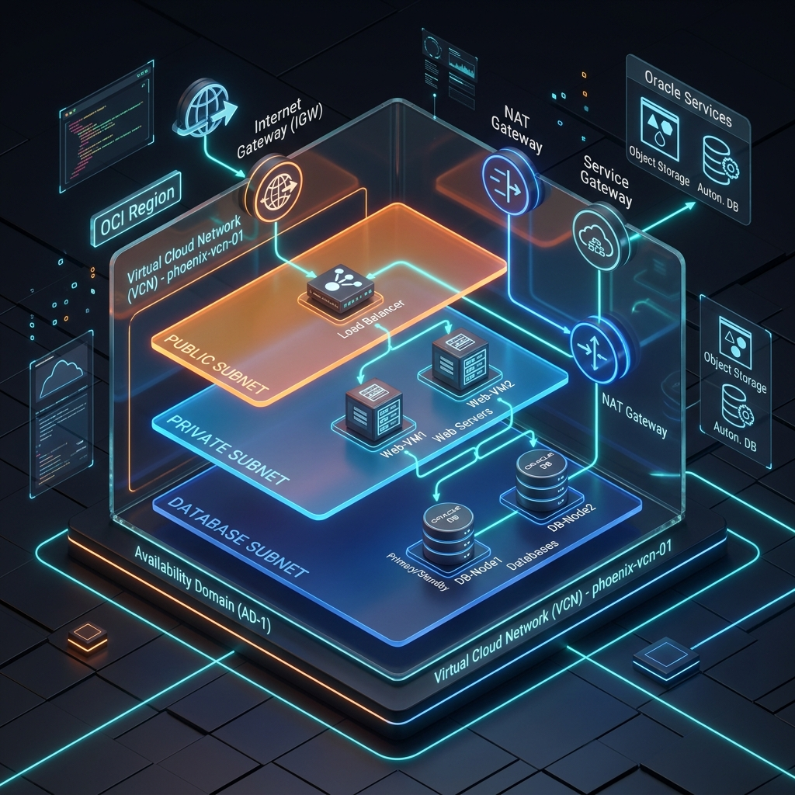

# Arquitetura VCN de Produção OCI

[](https://github.com/leonardodebs/OCI-Production-VCN-Architecture/actions/workflows/terraform-validate.yml)

Uma fundação de rede de nível de produção para Oracle Cloud Infrastructure (OCI) construída com Terraform, seguindo estritamente os limites do **Always Free Tier**.

## 🏗️ Diagrama da Arquitetura



### 🖼️ Visão Técnica 3D


## 📝 Comparação de Terminologia OCI vs AWS

| Recurso | Termo OCI | Termo AWS |
| :--- | :--- | :--- |
| Rede Virtual | VCN (Virtual Cloud Network) | VPC (Virtual Private Cloud) |
| Agrupamento de Identidade | Compartment | Conta AWS / OU |
| Controle de Acesso (Sub-rede) | Security List | Network ACL (NACL) |
| Controle de Acesso (Instância)| Network Security Group (NSG) | Security Group |
| Ponto de Entrada Público | Internet Gateway | Internet Gateway |
| Ponto de Saída Privado | NAT Gateway | NAT Gateway |
| Acesso a Serviços | Service Gateway | VPC Endpoint (Interface/Gateway) |
| Logs de Rede | VCN Flow Logs | VPC Flow Logs |

## 🚀 Guia de Configuração Passo a Passo

### 1. Pré-requisitos
- [Terraform](https://developer.hashicorp.com/terraform/downloads) >= 1.5
- [OCI CLI](https://docs.oracle.com/en-us/iaas/Content/API/SDKDocs/cliinstall.htm) configurado
- Par de chaves RSA gerado e adicionado ao seu Perfil de Usuário OCI

### 2. Gerar Chave de API (Se ainda não fez)
```bash
openssl genrsa -out oci_api_key.pem 2048
chmod 400 oci_api_key.pem
openssl rsa -pubout -in oci_api_key.pem -out oci_api_key_public.pem
```
*Faça o upload do `oci_api_key_public.pem` no Console OCI -> Configurações de Usuário -> Chaves de API.*

### 3. Inicializar Estado Remoto
Usamos o OCI Object Storage para persistência e bloqueio de estado.
```bash
chmod +x scripts/bootstrap-state.sh
./scripts/bootstrap-state.sh <SEU_TENANCY_OCID>
```

### 4. Implantar Ambiente
```bash
cd terraform/environments/dev
terraform init
terraform plan
terraform apply
```

## 💰 Detalhamento de Custos Always Free

Todos os recursos neste repositório se enquadram no OCI Always Free Tier.

| Recurso | Quantidade | Custo Mensal |
| :--- | :--- | :--- |
| **VCN** | 1 | US$ 0.00 |
| **Sub-redes** | 3 | US$ 0.00 |
| **Gateways** (IGW, NAT, SGW) | 1 de cada | US$ 0.00 |
| **Security Lists & NSGs** | Ilimitados | US$ 0.00 |
| **Object Storage** | Até 10GB | US$ 0.00 |
| **VCN Flow Logs** | Incluído no Free Tier | US$ 0.00 |
| **Total** | | **US$ 0.00** |

## 🛡️ Decisões de Arquitetura

### Por que Security Lists E NSGs?
Implementamos uma estratégia de **Defesa em Profundidade**:
- **Security Lists**: Aplicadas no nível da sub-rede. Elas atuam como uma política de segurança geral para todos na sub-rede (ex: bloquear todo tráfego não vindo da VCN para a sub-rede do Banco de Dados).
- **NSGs (Network Security Groups)**: Aplicados no nível da instância. Eles permitem um controle granular entre componentes específicos (ex: permitir apenas que o NSG do Servidor de Aplicação fale com a porta do Banco de Dados).

### Por que Service Gateway?
O Service Gateway permite que nossas instâncias privadas (App/DB) se comuniquem com os Serviços Oracle (como Gerenciamento de SO, Object Storage ou Vault) usando a **rede interna da Oracle**, em vez de rotear o tráfego pela internet pública através de um NAT Gateway. Isso aumenta a segurança e reduz a latência.

---
**Mantido por**: [Leonardo](https://github.com/leonardodebs)
**Tópicos**: #oracle-cloud #oci #terraform #vcn #infrastructure-as-code #devops
